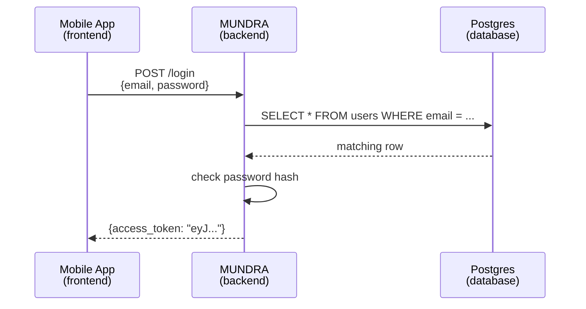
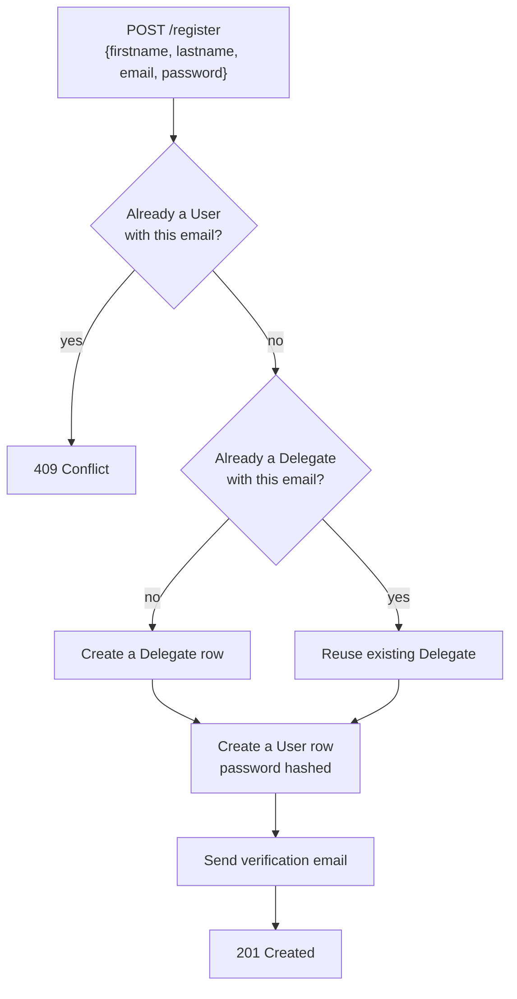
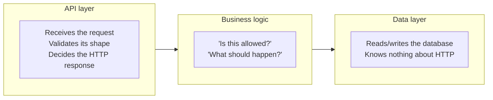

# Backend Development 101

A ground-up introduction to backend development: the vocabulary, how to think about system
design, and FastAPI fundamentals.

Written for someone who knows basic Python — variables, functions, loops, maybe classes —
but has never built a backend. Every term is defined the first time it's used.

Examples throughout come from **MUNDRA**, a real delegate-management backend built with
FastAPI and Postgres, rather than invented toy code — so the patterns here are ones that
survived contact with an actual running app.

---

## Table of contents

1. [What is a backend, actually?](#1-what-is-a-backend-actually)
2. [Glossary — the words you'll hear constantly](#2-glossary--the-words-youll-hear-constantly)
3. [Thinking in systems: how to design a backend](#3-thinking-in-systems-how-to-design-a-backend)
4. [FastAPI fundamentals](#4-fastapi-fundamentals)
5. [CRUD in FastAPI, one operation at a time](#5-crud-in-fastapi-one-operation-at-a-time)
6. [`app` vs `router`: what they are and when to use each](#6-app-vs-router-what-they-are-and-when-to-use-each)
7. [Quick reference](#7-quick-reference)
8. [Where to go next](#8-where-to-go-next)

---

## 1. What is a backend, actually?

Every app you've used has (at least) two halves:

- **Frontend** — what you see and tap. A login screen, the buttons, the text fields.
- **Backend** — the thing the frontend talks to over the internet to actually *do* anything.
  Check a password. Save a new delegate. Look up who's registered for a committee.

The frontend can't be trusted to do any of this itself — it's running on a stranger's
phone, and anyone can tamper with it. The backend is the part *you* control, running on
a server you own, that decides what's actually allowed to happen.



That round trip — app asks, backend decides, database stores, backend answers — is
*the* pattern. Everything in this document is filling in detail around that one loop.

**A backend's three jobs, always:**
1. **Talk to the outside world** — accept requests, send back responses. (This is the *API* layer.)
2. **Enforce the rules** — is this password right? Is this delegate allowed to see this data? (*Business logic*.)
3. **Remember things** — save data so it's still there after the request is over. (The *database*.)

---

## 2. Glossary — the words you'll hear constantly

Read this once, then use it as a reference. Terms are grouped, not alphabetical, because
they build on each other.

### The network conversation

| Term | Plain-English meaning |
|---|---|
| **Client** | Whatever is making the request — a mobile app, a browser, `curl`, Swagger UI. Not always a "user"; could be another server. |
| **Server** | The program listening for requests and answering them. For a FastAPI project, that's usually `uvicorn` running your app. |
| **Request** | One message from client to server: "please do this." Has a method, a path, headers, and sometimes a body. |
| **Response** | The server's answer: a status code, headers, and usually a body (often JSON). |
| **HTTP** | The language requests and responses are written in. Almost everything on the web speaks it. |
| **Endpoint** (a.k.a. **route**) | One specific "thing you can ask the server to do" — a combination of a path and a method. `POST /login` is one endpoint. `GET /login` (if it existed) would be a *different* endpoint. |
| **Method** | The *verb* of a request — what kind of action it is. See the table below. |
| **Path** | The *noun* of a request — which resource. `/delegates/42` means "the delegate with id 42." |
| **Status code** | A 3-digit number in the response saying what happened. `200` = OK. `404` = not found. `500` = the server broke. Full breakdown below. |
| **Header** | Metadata attached to a request or response, separate from the actual content. `Authorization: Bearer <token>` is a header — it's *about* the request, not the request's subject. |
| **Body** (a.k.a. **payload**) | The actual content being sent — the delegate's name, the password, the JSON blob. Not every request has one (a `GET` usually doesn't). |
| **JSON** | *JavaScript Object Notation* — the near-universal text format for structured data, e.g. `{"email": "ada@example.com", "verified": true}`. If you've written a Python dict, you already know JSON's shape. |

### HTTP methods — the verbs

| Method | Means | Example |
|---|---|---|
| `GET` | Read something. Never changes data. | `GET /delegates/me` — fetch my profile |
| `POST` | Create something new. | `POST /register` — create an account |
| `PATCH` | Update *part* of something. | `PATCH /delegates/{id}` — change one field |
| `PUT` | Replace something *entirely*. | `PUT /delegates/{id}` — overwrite the whole record |
| `DELETE` | Remove something. | `DELETE /account` — delete a login |

### Status codes — the vocabulary of "what happened"

| Range | Category | Common ones you'll actually see |
|---|---|---|
| `2xx` | Success | `200` OK · `201` Created (a `POST` that made something new) |
| `4xx` | **The client's** fault | `400` bad request · `401` not logged in · `403` logged in but not allowed · `404` doesn't exist · `409` conflict (e.g. "already registered") |
| `5xx` | **The server's** fault | `500` something broke on our end that shouldn't have |

The 4xx/5xx split matters: a `404` means "you asked correctly, that thing just isn't
there." A `500` means "our code has a bug." Confusing the two makes debugging much harder
— always check whether an error is a `4xx` (fix your request) or `5xx` (file a bug) first.

### The parts of a backend

| Term | Plain-English meaning |
|---|---|
| **API** (*Application Programming Interface*) | The full set of endpoints a backend exposes — the "menu" of things a client can ask it to do. |
| **REST** | A common *style* of designing APIs, where each endpoint represents a "resource" (a delegate, a room) and the HTTP method says what to do to it. `GET /delegates/{id}`, `PATCH /delegates/{id}`, `DELETE /delegates/{id}` — same resource, three verbs. |
| **Router** | A named, importable group of related endpoints — e.g. one file holding every delegate-related endpoint. Covered in depth in [Section 6](#6-app-vs-router-what-they-are-and-when-to-use-each). |
| **Middleware** | Code that runs on *every* request, before it reaches your endpoint — logging, rate limiting, CORS. |
| **Dependency injection** | A pattern where a route *declares* something it needs (e.g. "the current logged-in user"), and the framework figures out how to provide it before your function runs. In FastAPI this is the `Depends(...)` you'll see everywhere. |
| **Database** | Where data lives *permanently* — survives a server restart, unlike a Python variable. |
| **ORM** (*Object-Relational Mapper*) | A library that lets you work with database rows as Python objects instead of writing raw SQL. SQLAlchemy is the common Python one. |
| **Schema / Model** | A definition of the *shape* of some data — what fields it has, what types they are. A project usually has **two different kinds**: Pydantic models describing the *API's* shape, and ORM models describing the *database's* shape. They are not the same thing, and conflating them is one of the most common sources of confusion for beginners. |
| **Migration** | A recorded, ordered change to the database's structure (add a column, add a table). Alembic is the standard tool for this in SQLAlchemy projects. |

### Auth — the most jargon-dense corner

| Term | Plain-English meaning |
|---|---|
| **Authentication** ("authn") | *Who are you?* Proving identity — usually email + password. |
| **Authorization** ("authz") | *What are you allowed to do?* Even once we know who you are, maybe you can't see someone else's data. |
| **Token** | A piece of proof, issued after login, that says "this request comes from an already-verified user" — so you don't have to send your password on every single request. |
| **JWT** (*JSON Web Token*) | A specific, very common token format. It's a signed blob of JSON — the server can verify nobody tampered with it, without even needing to check a database. |
| **Bearer token** | The convention of sending a token in a request header: `Authorization: Bearer <token>`. "Bearer" means "whoever holds this token is treated as authenticated" — like a subway ticket, not a photo ID. |
| **Hashing** | A one-way scramble. `hash("password123")` always gives the same output, but you can't reverse it back to `"password123"`. Passwords are stored hashed so that even *we* can't read them. |

---

## 3. Thinking in systems: how to design a backend

Before writing any code, a system-design approach forces you to answer four questions,
**in this order**. Skipping ahead to "what code do I write" before answering these is the
single most common mistake.

### Step 1 — What are the *entities*?

An entity is a "thing" your system needs to remember. Nouns, not verbs. For MUNDRA:
a **Delegate**, a **User** (login credentials), a **Room**, a **Committee**.

> Write these down as a plain list before anything else. If you can't name the nouns,
> you don't understand the problem yet.

### Step 2 — What can happen to each entity?

For every entity, what operations does the system need? Usually some subset of
**Create, Read, Update, Delete** (CRUD — see Section 5). Not every entity needs all four:
MUNDRA's room allocations are *read-only* from the API's side — nobody `POST`s a new room
through the API, because rooms get decided once in a planning meeting and rarely change.

### Step 3 — Who's allowed to do what?

This is where authentication and authorization show up. A delegate can update *their own*
profile but not someone else's. An admin can see everyone's. Write this as a table before
coding it:

| Action | Delegate | Admin |
|---|---|---|
| View own profile | ✅ | ✅ |
| View another delegate's profile | ❌ | ✅ |
| Update own profile | ✅ | ✅ |
| List all delegates | ❌ | ✅ |

Every ❌ in that table is a permission check you'll need to write. Every row you *didn't*
think of is a security hole you'll ship.

### Step 4 — Draw the flow before you write a line of code

For anything nontrivial, sketch the request lifecycle. Here's registration in MUNDRA:



Notice this flow answers a design question that isn't obvious from the entity list alone:
*why are `Delegate` and `User` two separate things?* Because a `Delegate` can exist —
pre-registered by an admin, say — *before* anyone ever creates login credentials for them.
Modeling those as one entity would make "an admin pre-registers someone" impossible to
represent cleanly.

**This is what system design actually is** — not memorizing patterns, but asking "what
distinctions does my data actually need to make?"

### The layered mental model

Once you've answered the four questions, the code almost always falls into the same three
layers, regardless of framework or language:



The key discipline: **the data layer should have no idea HTTP exists.** Its functions
return data or raise plain Python exceptions — it's the API layer's job to translate that
into a status code. Keep that boundary clean and you can test your logic without spinning
up a server, and swap your database without touching your routes.

---

## 4. FastAPI fundamentals

**FastAPI** is a Python framework for building APIs. Three things make it worth learning first:

1. **You describe the shape of your data with normal Python type hints, and it validates
   requests automatically.** Get the type wrong, and the client gets a clear `422` error
   before your function even runs — you don't write that validation by hand.
2. **It generates interactive documentation for free** — a browsable Swagger UI listing
   every endpoint, every field, every response shape, always in sync with the real code
   because it's *generated from* the real code.
3. **It's built on `async`**, so it can handle many requests at once efficiently — though
   you don't need to understand `async`/`await` deeply to get started.

### The smallest possible FastAPI app

```python
from fastapi import FastAPI

app = FastAPI()

@app.get("/")
def read_root():
    return {"message": "hello"}
```

Run it with `uvicorn main:app --reload`, and you have a working API. Four things are
happening:

- `app = FastAPI()` creates *the* application — the thing `uvicorn` actually runs.
- `@app.get("/")` is a **decorator** — it registers the function below it to handle
  `GET` requests to path `/`. This pairing (decorator + function) is called a
  **path operation**, and it's the fundamental unit of a FastAPI app.
- The function name (`read_root`) can be anything — it's never called directly by you.
- Whatever the function `return`s gets converted to JSON automatically. Return a dict,
  get a JSON object back.

### Path parameters vs. query parameters vs. body

This trips people up constantly, so learn it as one comparison:

```python
@app.get("/delegates/{id}")           # path parameter
def get_delegate(id: str):
    ...

@app.get("/delegates")
def list_delegates(format: str = ""):  # query parameter
    ...

@app.post("/register")
def register(user: User):              # request body
    ...
```

| Kind | Where it lives | Example | When to use it |
|---|---|---|---|
| **Path parameter** | Part of the URL path itself, in `{braces}` | `/delegates/42` → `id="42"` | Identifying *which* specific resource |
| **Query parameter** | After a `?`, as `key=value` pairs | `/delegates?format=csv` → `format="csv"` | Optional filters, formatting, pagination |
| **Body** | The JSON payload of the request | `{"email": "...", "password": "..."}` | Sending a chunk of structured data — almost always on `POST`/`PATCH` |

FastAPI knows which is which **purely from how you declare the function** — a parameter
matching a `{name}` in the path is a path parameter; a parameter typed as a Pydantic model
is the body; anything else simple (`str`, `int`, `bool`) becomes a query parameter.
No separate configuration needed.

### Pydantic models: describing shapes

```python
from pydantic import BaseModel, EmailStr

class User(BaseModel):
    firstname: str
    lastname: str
    email: EmailStr
    password: str
```

This isn't a database table — it's a **shape description**. When a route declares
`user: User`, FastAPI:

1. Reads the incoming JSON body
2. Checks every field is present and the right type
3. If anything's wrong, sends back a `422` with exactly which field failed — automatically
4. If everything's right, hands you a real `User` object with autocomplete and type-checking

This is the single biggest quality-of-life difference from writing raw HTTP handlers by
hand: describe the shape once, and validation, error messages, and docs all come for free.

---

## 5. CRUD in FastAPI, one operation at a time

**CRUD** = **C**reate, **R**ead, **U**pdate, **D**elete — the four things you can do to a
piece of data. Almost every resource in almost every backend eventually needs some subset
of these four. Here's each one as a minimal pattern.

### Create — `POST`

```python
@router.post("/delegates", status_code=201)
def create_delegate(delegate: DelegateCreate):
    new_delegate = database.add_delegate(delegate)
    return new_delegate
```

- `status_code=201` — the convention for "a `POST` that successfully made something new."
- The request body is validated against `DelegateCreate` before this function even runs.

### Read — `GET`

```python
@router.get("/delegates/{id}")
def get_delegate(id: str):
    delegate = database.get_delegate_by_id(id)
    if not delegate:
        raise HTTPException(status_code=404, detail="Delegate not found")
    return delegate
```

- Reads never change data. If a `GET` request modifies something, that's a design smell.
- `raise HTTPException(...)` is how you send back a non-200 response — FastAPI catches it
  and turns it into the right status code and JSON body.

### Update — `PATCH`

```python
@router.patch("/delegates/{id}")
def update_delegate(id: str, firstname: str = ""):
    delegate = database.get_delegate_by_id(id)
    if not delegate:
        raise HTTPException(status_code=404, detail="Delegate not found")
    if firstname != "":
        delegate.firstname = firstname
    return database.update_delegate_by_id(id, delegate)
```

- `PATCH` means *partial* update — you only send the fields you want to change.
  (`PUT` means "replace the whole thing.")
- Notice the pattern: fetch first, check it exists, *then* modify. Never blindly write to
  something you haven't confirmed is there.

### Delete — `DELETE`

```python
@router.delete("/delegates/{id}", status_code=200)
def delete_delegate(id: str):
    delegate = database.get_delegate_by_id(id)
    if not delegate:
        raise HTTPException(status_code=404, detail="Delegate not found")
    database.delete_delegate(id)
    return {"message": "Delegate deleted"}
```

- Same fetch-check-act pattern as update.
- **Deciding what a `DELETE` actually removes is a real design choice.** In MUNDRA,
  `DELETE /account` deletes only the *login credentials* — not the delegate's conference
  registration. Someone can delete their account without erasing the fact that they
  attended. That's a deliberate product decision encoded in code, and the kind of thing
  worth discussing before implementing rather than after.

### The shape they all share

Every one of these follows the same skeleton:

```
1. Receive input (path param / query param / body)
2. Fetch anything you need to check first
3. Check it's allowed (does it exist? are you permitted?)
4. Do the actual work
5. Return a response with the right status code
```

Once you can see that skeleton under any endpoint, reading unfamiliar backend code gets
much faster — you're just identifying which lines are which step.

---

## 6. `app` vs `router`: what they are and when to use each

This is the FastAPI-specific question people ask most, so it gets its own section.

### `FastAPI()` — the app

```python
app = FastAPI(title="MUNDRA")
```

There is **exactly one** of these per project. It's the actual thing `uvicorn` runs. It
holds the *global* configuration: the title, whether docs are enabled, what middleware
runs on every request, and — crucially — the final assembled list of every endpoint in
the entire system.

### `APIRouter()` — the router

```python
# routers/delegates.py
router = APIRouter()

@router.get("/me")
def get_current_delegate(...):
    ...
```

An `APIRouter` looks and behaves almost identically to `app` — same decorators
(`@router.get`, `@router.post`, etc.), same rules. **The only difference is that a router
isn't runnable by itself.** It's a portable *bag of endpoints* that has to be attached to
the real `app` before it does anything:

```python
# main.py
from routers.delegates import router as delegates_router

app.include_router(delegates_router, prefix="/delegates", tags=["Delegates"])
```

That one line does two useful things:

- **`prefix="/delegates"`** — every path inside that router gets `/delegates` stuck on the
  front automatically. The route defined as `@router.get("/me")` becomes `GET /delegates/me`
  for real. The router file never has to repeat `/delegates` on every single line.
- **`tags=["Delegates"]`** — cosmetic but genuinely useful: it groups these endpoints
  together in the Swagger docs instead of one long undifferentiated list.

### Why bother splitting at all?

Because a real backend accumulates dozens of endpoints, and one file holding all of them
becomes unreadable and impossible to review in a pull request. MUNDRA used to be a single
850-line `app.py`. It's now a 40-line `main.py` plus seven small `routers/*.py` files, each
focused on one resource:

```
main.py                    ← creates the app, includes every router
routers/
    auth.py                ← register, login, refresh, logout
    delegates.py           ← delegate profile CRUD
    mumbaimun.py           ← conference registration
    qr.py, food.py         ← QR codes, meal check-in
    admin.py               ← admin-only utilities
    dynamic_data.py        ← static JSON data
```

Nothing about *what the API does* changed — only how the code is organized. But now "where
do I add a login-related endpoint?" has an obvious answer, and two people can work on
different features without fighting over the same file.

### The rule of thumb

| Situation | Use |
|---|---|
| Wiring the whole application together — title, middleware, which routers exist | `app`, in `main.py`, and **only** there |
| Defining endpoints for a specific resource (delegates, rooms, auth...) | A `router`, in its own file under `routers/` |
| A handful of endpoints in a genuinely tiny prototype | `app` directly is fine — don't build a `routers/` structure for a 3-endpoint toy. Split it out once it grows past one screenful of code. |

**The mental shortcut:** `app` is the *building*. A `router` is *one floor of offices* in
it — organized, self-contained, and pointless without the building around it.

---

## 7. Quick reference

| I want to... | Use |
|---|---|
| Get one thing by its ID | `GET /resource/{id}` — path parameter |
| Get a filtered/formatted list | `GET /resource?filter=value` — query parameter |
| Create something | `POST /resource` — body, `status_code=201` |
| Change part of something | `PATCH /resource/{id}` — body with optional fields |
| Remove something | `DELETE /resource/{id}` |
| Describe an incoming JSON shape | A Pydantic `BaseModel` |
| Require login on a route | `Depends(get_current_user)` as a function parameter |
| Group related endpoints | `APIRouter()` in its own file under `routers/` |
| Wire the whole app together | `FastAPI()` — once, in `main.py` |
| Return an error | `raise HTTPException(status_code=..., detail="...")` |

---

## 8. Where to go next

Reading only gets you so far — the fastest way to make this stick is to build the smallest
possible thing end to end. In rough order of difficulty:

1. **Run the hello-world app** from Section 4. Open the Swagger docs. Click the endpoint.
   Watch a request actually happen.
2. **Add all four CRUD endpoints** for a single made-up resource — a book, a task, a snack
   — storing them in a plain Python dict. No database yet. This teaches routing and
   Pydantic without any extra moving parts.
3. **Split those endpoints into a router** and include it from `main.py` with a prefix.
   Watch the paths change in the docs. This is Section 6 made concrete.
4. **Swap the dict for a real database** using SQLAlchemy. This is the biggest jump, and
   where the "two kinds of models" distinction from the glossary starts to matter.
5. **Add authentication** so some endpoints require a token.

Useful references once you're past the basics:

- [FastAPI's official tutorial](https://fastapi.tiangolo.com/tutorial/) — genuinely one of
  the best framework docs written; work through it in order
- [Pydantic docs](https://docs.pydantic.dev/) — for anything about validation and shapes
- [SQLAlchemy ORM tutorial](https://docs.sqlalchemy.org/en/20/orm/quickstart.html) — when
  you reach step 4
