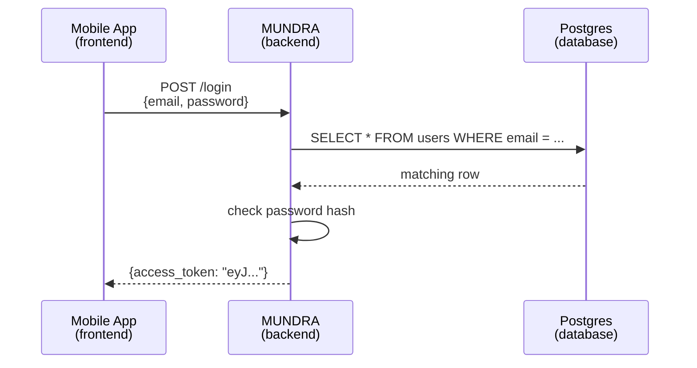
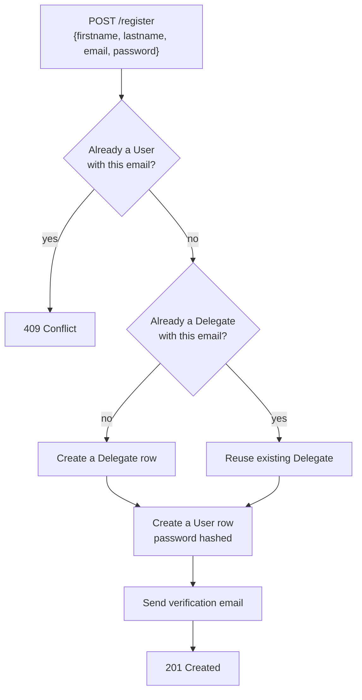
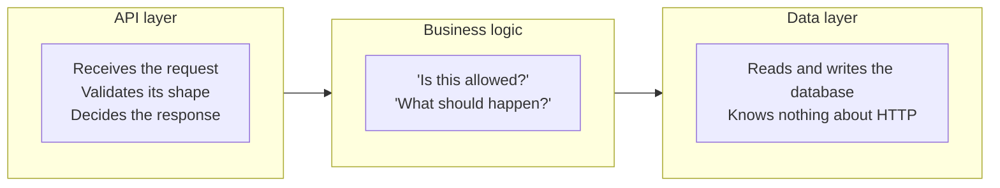
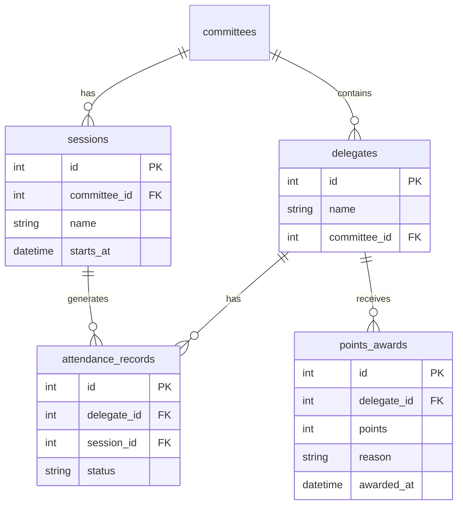

# Backend Development 101

I wrote this for the MUNSoc tech team. It's the guide I wish someone had handed me before
I started building MUNDRA, our delegate management backend.

If you know basic Python (variables, functions, loops, maybe classes) but have never built
a backend, this is aimed at you. I define every term the first time it shows up, because
the jargon was honestly the hardest part for me at the start.

Most of the examples come from MUNDRA itself rather than made up toy code. That's partly
because real examples are more useful, and partly because most of the mistakes in here are
ones I actually made while building it.

Once you're through this, [Part 2](./README.md) gets MUNDRA running on
your laptop and walks through every endpoint in it.

---

## Table of contents

1. [What is a backend, actually?](#1-what-is-a-backend-actually)
2. [Glossary: the words you'll hear constantly](#2-glossary-the-words-youll-hear-constantly)
3. [Thinking in systems](#3-thinking-in-systems)
4. [FastAPI fundamentals](#4-fastapi-fundamentals)
5. [CRUD, one operation at a time](#5-crud-one-operation-at-a-time)
6. [app vs router](#6-app-vs-router)
7. [Quick reference](#7-quick-reference)
8. [How I'd structure your first backend](#8-how-id-structure-your-first-backend)
9. [Case study: designing a system from scratch](#9-case-study-designing-a-system-from-scratch)
10. [Your turn](#10-your-turn)
11. [Further reading](#11-further-reading)

---

## 1. What is a backend, actually?

Every app you've used has at least two halves.

The **frontend** is what you see and tap. The login screen, the buttons, the text fields.

The **backend** is the thing the frontend talks to over the internet to actually do
anything. Check a password. Save a new delegate. Look up who's registered for a committee.

The reason we can't just do all of this in the app is trust. The frontend runs on a
stranger's phone and anyone can tamper with it. The backend is the part we control,
running on a server we own, and it's the thing that decides what's actually allowed to
happen.



That round trip is the whole pattern. App asks, backend decides, database stores, backend
answers. Everything else in this doc is just detail around that one loop.

A backend has three jobs, always:

1. Talk to the outside world. Accept requests, send back responses. This is the API layer.
2. Enforce the rules. Is this password right? Can this delegate see this data? This is the
   business logic.
3. Remember things. Save data so it survives a restart. That's the database.

---

## 2. Glossary: the words you'll hear constantly

Read this once, then come back to it. I grouped the terms instead of alphabetising them
because they build on each other.

### The network conversation

| Term | What it means |
|---|---|
| **Client** | Whatever is making the request. Our mobile app, a browser, `curl`, the Swagger page. Not always a person, it could be another server. |
| **Server** | The program listening for requests and answering them. For us that's `uvicorn` running the app. |
| **Request** | One message from client to server saying "please do this". It has a method, a path, headers, and sometimes a body. |
| **Response** | The answer. A status code, headers, and usually a body (normally JSON). |
| **HTTP** | The language requests and responses are written in. Nearly everything on the web speaks it. |
| **Endpoint** (or **route**) | One specific thing you can ask the server to do. It's a path plus a method together. `POST /login` is one endpoint, `GET /login` would be a completely different one. |
| **Method** | The verb of the request. Table below. |
| **Path** | The noun. `/delegates/42` means "the delegate with id 42". |
| **Status code** | A 3 digit number saying what happened. `200` is fine, `404` is not found, `500` means we broke something. |
| **Header** | Metadata attached to the request, separate from the content. `Authorization: Bearer <token>` is a header. It's *about* the request rather than being the request's subject. |
| **Body** (or **payload**) | The actual content being sent. The delegate's name, the password, the JSON blob. A `GET` usually doesn't have one. |
| **JSON** | The standard text format for structured data, like `{"email": "ada@example.com", "verified": true}`. If you've written a Python dict you already know the shape. |

### HTTP methods

| Method | Means | Example |
|---|---|---|
| `GET` | Read something. Never changes data. | `GET /delegates/me` to fetch my profile |
| `POST` | Create something new. | `POST /register` to make an account |
| `PATCH` | Update part of something. | `PATCH /delegates/{id}` to change one field |
| `PUT` | Replace something entirely. | `PUT /delegates/{id}` to overwrite the record |
| `DELETE` | Remove something. | `DELETE /account` |

### Status codes

| Range | Whose fault | The ones you'll actually see |
|---|---|---|
| `2xx` | Nobody, it worked | `200` OK, `201` Created (a `POST` that made something) |
| `4xx` | The client's | `400` bad request, `401` not logged in, `403` logged in but not allowed, `404` doesn't exist, `409` conflict (like "already registered") |
| `5xx` | Ours | `500` something broke that shouldn't have |

The 4xx vs 5xx split matters more than it looks. A `404` means you asked correctly and the
thing just isn't there. A `500` means our code has a bug. When something breaks, the first
thing I check is which of the two it is, because it tells me whether to go fix my request
or go read the server logs.

### Parts of a backend

| Term | What it means |
|---|---|
| **API** | The full set of endpoints a backend exposes. The menu of things a client can ask for. |
| **REST** | A style of designing APIs where each endpoint is a "resource" and the method says what to do to it. `GET /delegates/{id}`, `PATCH /delegates/{id}`, `DELETE /delegates/{id}`. Same resource, three verbs. |
| **Router** | A named group of related endpoints, usually one file. Section 6 goes into this properly. |
| **Middleware** | Code that runs on every request before it reaches your endpoint. Logging, rate limiting, CORS. |
| **Dependency injection** | Where a route declares something it needs ("the current logged in user") and the framework works out how to supply it before your function runs. In FastAPI this is `Depends(...)`. |
| **Database** | Where data lives permanently. Survives a restart, unlike a Python variable. |
| **ORM** | Object Relational Mapper. A library letting you treat database rows as Python objects instead of writing SQL by hand. SQLAlchemy is the usual one in Python. |
| **Schema / Model** | A definition of the shape of some data. Which fields, what types. You normally end up with **two different kinds**: Pydantic models for the API's shape, ORM models for the database's shape. They are not the same thing and mixing them up confused me for a solid week. |
| **Migration** | A recorded change to the database structure, like adding a column. Alembic is the tool we use. |

### Auth

| Term | What it means |
|---|---|
| **Authentication** (authn) | Who are you? Proving identity, usually with email and password. |
| **Authorization** (authz) | What are you allowed to do? We might know who you are and still not let you see someone else's data. |
| **Token** | A piece of proof handed out after login so you don't have to send your password on every single request. |
| **JWT** | JSON Web Token. A specific token format. It's a signed blob of JSON, so the server can check nobody tampered with it without even hitting the database. |
| **Bearer token** | The convention of sending a token as `Authorization: Bearer <token>`. "Bearer" means whoever holds it gets treated as authenticated, like a metro ticket rather than a photo ID. |
| **Hashing** | A one way scramble. `hash("password123")` always gives the same output but you can't reverse it. We store passwords hashed so that even we can't read them. |

---

## 3. Thinking in systems

Before writing code I now force myself to answer four questions in order. I didn't do this
on the first version of MUNDRA and I paid for it in rewrites.

### Step 1: what are the entities?

An entity is a thing your system has to remember. Nouns, not verbs. For MUNDRA that's a
**Delegate**, a **User** (login credentials), a **Room**, a **Committee**.

Write these on paper before anything else. If you can't name the nouns, you don't
understand the problem yet, and no amount of typing will fix that.

### Step 2: what can happen to each one?

For each entity, what does the system actually need to do? Usually some subset of Create,
Read, Update, Delete (see section 5). Not everything needs all four. Our room allocations
are read only from the API's side, nobody creates a room over HTTP, because rooms get
decided once in a planning meeting and barely change after that.

### Step 3: who's allowed to do what?

This is where auth shows up. A delegate can edit their own profile but not someone else's.
An admin can see everyone. I write it as a table before I write any code:

| Action | Delegate | Admin |
|---|---|---|
| View own profile | yes | yes |
| View another delegate's profile | no | yes |
| Update own profile | yes | yes |
| List all delegates | no | yes |

Every "no" in that table is a permission check you have to write. Every row you forget to
think about is a hole you ship.

### Step 4: draw the flow first

For anything non trivial I sketch the request lifecycle before coding. Here's registration
in MUNDRA:



Drawing this is what made me realise why `Delegate` and `User` have to be separate tables.
A delegate can exist before anyone makes login credentials for them, for example when an
admin pre registers someone. If I'd modelled those as one thing, "admin pre registers a
delegate" would have been impossible to represent without a fake password.

That's what system design actually is. Not memorising patterns, just asking what
distinctions your data genuinely needs to make.

### The three layers

Once you've answered those, the code tends to fall into the same three layers no matter
what framework you use:



The bit I'd emphasise: the data layer should have no idea HTTP exists. Its functions
return data or raise a normal Python exception, and it's the API layer's job to turn that
into a status code. Keep that line clean and you can test your logic without starting a
server, and swap your database without touching your routes.

---

## 4. FastAPI fundamentals

FastAPI is the Python framework we use to build the API. Three reasons it's worth learning
first:

1. You describe your data with normal Python type hints and it validates incoming requests
   for you. Send the wrong type and the client gets a clear `422` before your function even
   runs. You never write that validation by hand.
2. You get interactive docs for free. That's the Swagger page, and because it's generated
   from the real code it can't go stale.
3. It's built on async, so it handles a lot of requests at once. You don't need to
   understand async deeply to start.

### The smallest possible app

```python
from fastapi import FastAPI

app = FastAPI()

@app.get("/")
def read_root():
    return {"message": "hello"}
```

Run it with `uvicorn main:app --reload` and you have a working API. Four things happening:

- `app = FastAPI()` creates the application, the thing uvicorn actually runs.
- `@app.get("/")` is a decorator. It registers the function underneath to handle `GET`
  requests to `/`. This pairing is called a path operation and it's the basic unit of the
  whole framework.
- The function name doesn't matter, you never call it yourself.
- Whatever you return gets turned into JSON automatically. Return a dict, get a JSON
  object.

### Path params vs query params vs body

This one took me embarrassingly long to internalise, so learn it as one comparison:

```python
@app.get("/delegates/{id}")           # path parameter
def get_delegate(id: str):
    ...

@app.get("/delegates")
def list_delegates(format: str = ""):  # query parameter
    ...

@app.post("/register")
def register(user: User):              # request body
    ...
```

| Kind | Where it goes | Example | Use it for |
|---|---|---|---|
| **Path param** | In the URL path, in braces | `/delegates/42` gives `id="42"` | Saying *which* specific thing |
| **Query param** | After a `?` as key=value | `/delegates?format=csv` gives `format="csv"` | Optional filters, formatting, paging |
| **Body** | The JSON payload | `{"email": "...", "password": "..."}` | Sending a chunk of structured data, nearly always on POST or PATCH |

FastAPI works out which is which purely from how you write the function signature. A
parameter matching a `{name}` in the path is a path param, a parameter typed as a Pydantic
model is the body, anything else simple becomes a query param. There's no config to write.

### Pydantic models

```python
from pydantic import BaseModel, EmailStr

class User(BaseModel):
    firstname: str
    lastname: str
    email: EmailStr
    password: str
```

This is not a database table. It's a description of a shape. When a route says
`user: User`, FastAPI reads the JSON body, checks every field is present and the right
type, and if anything's wrong it sends back a `422` naming the exact field that failed.
If everything's fine you get a real `User` object with autocomplete.

Describing the shape once and getting validation, error messages and docs out of it is the
single biggest reason I'd pick FastAPI for a first backend.

---

## 5. CRUD, one operation at a time

CRUD is Create, Read, Update, Delete. Four things you can do to a piece of data. Almost
every resource in almost every backend needs some subset of them.

### Create, with POST

```python
@router.post("/delegates", status_code=201)
def create_delegate(delegate: DelegateCreate):
    new_delegate = database.add_delegate(delegate)
    return new_delegate
```

`status_code=201` is the convention for a POST that successfully made something new. The
body gets validated against `DelegateCreate` before the function runs.

### Read, with GET

```python
@router.get("/delegates/{id}")
def get_delegate(id: str):
    delegate = database.get_delegate_by_id(id)
    if not delegate:
        raise HTTPException(status_code=404, detail="Delegate not found")
    return delegate
```

Reads never change data. If a GET modifies something, that's a design smell.
`raise HTTPException(...)` is how you return anything other than a 200, FastAPI catches it
and builds the right response.

### Update, with PATCH

```python
@router.patch("/delegates/{id}")
def update_delegate(id: str, firstname: str = ""):
    delegate = database.get_delegate_by_id(id)
    if not delegate:
        raise HTTPException(status_code=404, detail="Delegate not found")
    if firstname != "":
        delegate.firstname = firstname
    return database.update_delegate_by_id(id, delegate)
```

PATCH is a partial update, you only send the fields you want changed. PUT means replace
the whole thing. Note the order here: fetch, check it exists, then modify. Don't write to
something you haven't confirmed is there.

### Delete

```python
@router.delete("/delegates/{id}", status_code=200)
def delete_delegate(id: str):
    delegate = database.get_delegate_by_id(id)
    if not delegate:
        raise HTTPException(status_code=404, detail="Delegate not found")
    database.delete_delegate(id)
    return {"message": "Delegate deleted"}
```

Same fetch, check, act shape as update.

Deciding what a delete actually removes is a real design decision and worth arguing about
before you build it. In MUNDRA, `DELETE /account` only removes the login credentials, not
the delegate's conference registration. Someone can delete their account without us losing
the record that they attended. That was deliberate, and it's the kind of thing that's
painful to change later.

### They all have the same skeleton

```
1. Take the input (path param, query param, body)
2. Fetch whatever you need to check
3. Check it's allowed (does it exist, are you permitted)
4. Do the work
5. Return with the right status code
```

Once you can see that shape under any endpoint, reading unfamiliar backend code gets a lot
faster. You're just working out which lines are which step.

---

## 6. app vs router

This is the question I get asked most, so it gets its own section.

### FastAPI() is the app

```python
app = FastAPI(title="MUNDRA")
```

There's exactly one of these in a project. It's what uvicorn runs. It holds the global
config: the title, whether docs are on, what middleware runs on every request, and the
final assembled list of every endpoint in the system.

### APIRouter() is a router

```python
# routers/delegates.py
router = APIRouter()

@router.get("/me")
def get_current_delegate(...):
    ...
```

A router looks almost identical to the app. Same decorators, same rules. The one real
difference is that a router can't run on its own. It's a portable bag of endpoints that
has to be attached to the actual app before it does anything:

```python
# main.py
from routers.delegates import router as delegates_router

app.include_router(delegates_router, prefix="/delegates", tags=["Delegates"])
```

That line is doing two things worth knowing about:

`prefix="/delegates"` sticks `/delegates` on the front of every path inside that router.
The route written as `@router.get("/me")` actually becomes `GET /delegates/me`. So the
router file never repeats `/delegates` on every line.

`tags=["Delegates"]` is cosmetic but useful. It groups those endpoints together on the
Swagger page instead of leaving one long undifferentiated list.

### Why split at all

Because a real backend piles up endpoints fast and one file holding all of them becomes
impossible to read or review. MUNDRA was a single 850 line `app.py` for a while and it was
genuinely painful to work in. It's now a 40 line `main.py` plus seven small router files:

```
main.py                    creates the app, includes every router
routers/
    auth.py                register, login, refresh, logout
    delegates.py           delegate profile CRUD
    mumbaimun.py           conference registration
    qr.py, food.py         QR codes, meal check in
    admin.py               admin only utilities
    dynamic_data.py        static JSON data
```

Nothing about what the API does changed. Only where the code lives. But now "where do I
add a login endpoint" has an obvious answer, and two people can work on different features
without fighting over the same file.

### Rule of thumb

| Situation | Use |
|---|---|
| Wiring the app together: title, middleware, which routers exist | `app`, in `main.py`, and only there |
| Defining endpoints for a specific resource | a `router`, in its own file under `routers/` |
| A tiny prototype with three endpoints | just use `app` directly. Don't build a routers folder for a toy. Split once it outgrows one screen. |

The way I think about it: `app` is the building, a `router` is one floor of offices in it.
Organised, self contained, and useless without the building around it.

---

## 7. Quick reference

| I want to | Use |
|---|---|
| Get one thing by id | `GET /resource/{id}`, path param |
| Get a filtered list | `GET /resource?filter=value`, query param |
| Create something | `POST /resource`, body, `status_code=201` |
| Change part of something | `PATCH /resource/{id}` |
| Remove something | `DELETE /resource/{id}` |
| Describe incoming JSON | a Pydantic `BaseModel` |
| Require login on a route | `Depends(get_current_user)` as a parameter |
| Group related endpoints | `APIRouter()` in its own file |
| Wire the app together | `FastAPI()`, once, in `main.py` |
| Return an error | `raise HTTPException(status_code=..., detail="...")` |

---

## 8. How I'd structure your first backend

### The order I build things in now

My first attempt at this went badly. I wrote about fifteen endpoints, then found out my
database connection had been misconfigured the entire time and half of what I'd written
had to change. So: build depth before breadth. Get one endpoint working end to end, then
repeat.

| # | Build | Why here |
|---|---|---|
| 1 | The entity list, on paper | No code yet. If you can't name the nouns, code won't save you. |
| 2 | `config.py` | Reads your env vars. Everything else needs settings, the DB url, the secret key. |
| 3 | `database.py` | Connection and session setup. Nothing touches data without it. |
| 4 | `db_models.py` | Your tables as Python classes. |
| 5 | Your first migration | `alembic revision --autogenerate`, then `alembic upgrade head`. Now the tables physically exist. |
| 6 | `models.py` | The Pydantic shapes the API accepts and returns. |
| 7 | `main.py` plus one router with ONE endpoint | The whole pipe, end to end. Do not skip this. |
| 8 | Everything else | Now adding endpoints is repetitive instead of risky. |

Step 7 is the one that saves you. A single working endpoint that reads one row proves your
config, connection, models, migration, routing and server are all correct at the same
time. After that, any bug is in the endpoint you just wrote rather than buried somewhere
in the foundations.

### Where files go

This is the layout I'd use from day one:

```
your-project/
├── main.py              creates the app, includes routers, nothing else
├── config.py            settings read from .env
├── database.py          engine, session, data access functions
├── db_models.py         SQLAlchemy tables
├── models.py            Pydantic request and response shapes
├── auth.py              hashing, tokens, get_current_user
├── routers/
│   ├── __init__.py
│   ├── users.py         one file per resource
│   └── items.py
├── alembic/             migration scripts. COMMIT THESE.
├── alembic.ini
├── .env                 real secrets. never committed.
├── .env.example         same keys, empty values. always committed.
├── .gitignore
├── pyproject.toml       dependencies
└── README.md
```

The reasoning behind it:

One file per resource in `routers/`, so "where do I add a login endpoint" is answerable
without reading any code.

`main.py` stays small. It wires things together, it doesn't define behaviour. If it's
growing, something belongs in a router.

`.env.example` matters more than people think. It's the only way a new teammate knows
which variables they need to set. Same keys as your real `.env`, values stripped out.

Commit your migrations. They're the history of your schema. Someone pulls your branch,
runs `alembic upgrade head`, and their database matches yours exactly.

### When to grow it

Don't build folders you don't need yet. But eventually:

| Add | When |
|---|---|
| `services/` | Business logic gets complex enough that routes are hard to read. Routes call services, services hold the "what should happen". |
| `tests/` | As early as you can stand, honestly. |
| `schemas/` split out of `models.py` | Once you have 10 or more Pydantic models and one file gets unwieldy. |

### Things I'd do from the start

| Practice | Why |
|---|---|
| Keep routes thin | A route should read input, check permission, call a function, return. Forty lines of logic in a route belongs in `database.py` or a service. |
| Data layer never raises `HTTPException` | `database.py` shouldn't know HTTP exists. It returns data or `None`, the router decides `None` means 404. This is what lets you test logic without a server. |
| Separate input and output models | See mistake 1 below. |
| Every schema change is a migration | Never edit the database by hand. If it isn't in `alembic/versions/`, it doesn't exist on anyone else's machine. |
| Return correct status codes | 201 created, 404 missing, 403 not allowed. Clients branch on these, and so will you in three months. |
| Never log tokens or passwords | They end up in log files, which end up in screenshots, which end up in group chats. |
| Write the error path first | Write `if not found: raise 404` before the happy path. It's the half everyone forgets and the half that breaks in production. |

### Five mistakes I've made or watched happen

**1. One Pydantic model for both input and output.** You accept a `User` with a `password`
field and then return a `User` from `GET /users/{id}`, and now your API serves password
hashes to anybody who asks. Use `UserCreate` with the password for input and `UserPublic`
without it for output. Two models, always.

**2. Editing the database by hand.** Works on your laptop, works nowhere else, and nobody
can reproduce your schema. Migrations every time.

**3. Wrapping everything in `try/except Exception` and returning 500.** This swallows your
own deliberate 404s and 403s and reports them as server errors, so every bug looks
identical when you're debugging. Let real errors bubble up, only catch what you can
actually handle.

**4. Committing `.env`.** Your secret key is now in git history permanently, and deleting
the file in a later commit does not remove it. Gitignore it on day one. If it does get
committed, rotate the secret rather than just deleting the line.

**5. Assuming a blank env var means unset.** `DOCS_URL=` in a `.env` file sets it to an
empty string, which overrides your code's default instead of falling back to it. This one
cost me a confusing half hour. If you want the default, delete the line entirely.

---

## 9. Case study: designing a system from scratch

Here's how a design conversation actually goes, using the four steps from section 3. Read
this, then do the exercise in section 10 yourself.

> **The brief:** "We want to track attendance and points for committee sessions."

That's all you get. Realistically that's all you'll ever get. The job is turning it into a
design.

### Step 1: ask questions before designing anything

A vague brief is hiding a dozen decisions. The questions I'd ask:

| Question | Answer | Why it changes things |
|---|---|---|
| Who uses this? | Chairs mark attendance, delegates view their own record | Two roles, so we need a permission matrix |
| How many delegates? | ~200, 10 committees, 3 days | Small. No caching, no scaling complexity needed |
| Per session or per day? | Per session, 9 total | Attendance is per delegate per session, not one flag |
| Do we need history? | Yes, "how many sessions did Ada miss" | Rules out storing a running count |
| Who awards points, can they be revoked? | Chairs award, and mistakes happen so yes | Points need an audit trail, not a single total |

Every one of those answers killed a design that would otherwise have seemed fine. Fifteen
minutes of questions saves a migration later.

### Step 2: entities and shape

From those answers: **Delegate**, **Committee**, **Session**, **AttendanceRecord**,
**PointsAward**.



The decision worth noticing: attendance is its own table, not a `present: bool` column on
the delegate. A delegate attends many sessions and a single boolean can't hold that.
Any time you hear "one X has many Y", Y is its own table with a foreign key back to X.

Same logic for points. Each award is a row rather than a `total_points` number, so we can
answer "who gave these and why" and undo a mistake. A running total can only ever tell you
how many, and it can never be audited.

### Step 3: endpoints and permissions

| Method | Path | Who | Does |
|---|---|---|---|
| `GET` | `/sessions/{id}/attendance` | Chair of that committee | The roster to mark |
| `POST` | `/sessions/{id}/attendance` | Chair of that committee | Submit attendance |
| `GET` | `/delegates/me/attendance` | Any delegate | Their own record only |
| `POST` | `/delegates/{id}/points` | Chair of that committee | Award points with a reason |
| `DELETE` | `/points/{id}` | Chair who awarded it, or admin | Revoke a mistake |
| `GET` | `/committees/{id}/leaderboard` | Anyone in that committee | Standings |

| Action | Delegate | Chair | Admin |
|---|---|---|---|
| Mark attendance | no | yes, own committee | yes |
| View own attendance | yes | yes | yes |
| View others' attendance | no | yes, own committee | yes |
| Award or revoke points | no | yes, own committee | yes |

"Own committee" keeps showing up, which is a real constraint. Writing it in the table is
how you remember to actually implement it, instead of shipping a chair who can mark
attendance for a committee they don't run.

### Step 4: what I'd build first

Following the order from section 8: `config.py`, `database.py`, the five tables,
migration, Pydantic models, then one endpoint (`GET /delegates/me/attendance`, the
simplest read), then the rest.

Five tables, six endpoints, one permission rule that repeats. Completely doable, and it
stayed that small because the questions in step 1 stopped it from ballooning.

---

## 10. Your turn

Same process, different brief. Do this before writing any code.

> **The brief:** "After each committee session, delegates should be able to rate their
> chair out of 5 and leave a comment. Chairs should see how they're doing. But delegates
> need to feel safe being honest."

### Part A: design it on paper, about 45 minutes

Give me five things:

1. **A questions list.** At least six things you'd ask before designing. This is the part
   everyone skips and the part that matters most.
2. **An entity list** with a one line description of each.
3. **An ER diagram.** Hand drawn is fine.
4. **An endpoint table.** Method, path, who can call it, what it does.
5. **A permission matrix.** Delegate, chair, admin down the side.

The interesting problem here is the anonymity bit. "Delegates need to feel safe" pulls
against "we can't let one person submit fifty ratings". You have to know who submitted in
order to enforce one per session, but the chair must never see it. Write two or three
sentences on how your design handles that. There's more than one good answer, I care that
you picked one deliberately and can defend it.

### Part B: build it

1. Set it up using the structure and build order from section 8.
2. Get one endpoint working end to end before writing any others.
3. Implement the rest of your endpoint table.
4. Enforce your permission matrix. Every "no" in that table is something you should be
   able to try in Swagger and watch get rejected.

### You're done when

- [ ] A delegate can submit a rating and cannot submit twice for the same session
- [ ] A delegate can see their own submissions
- [ ] A chair sees their average rating and the comments, with no names attached
- [ ] A chair cannot see another chair's ratings
- [ ] An admin can see everything
- [ ] Endpoints return sensible codes: 201 on create, 403 not allowed, 404 missing, 409 duplicate
- [ ] `.env` is gitignored and `.env.example` exists
- [ ] Every table came from a migration, not from hand editing the database

### Then look back

When it works, reread your part A design. What did you get wrong? Which entity did you
miss? Which permission did you not think about until you were halfway through building it?

That gap between the design you wrote and the design you needed is the thing this whole
doc is trying to shrink. Nobody gets it right first time, I certainly didn't. The goal is
just to find the gap on paper instead of in production.

---

## 11. Further reading

- [FastAPI's tutorial](https://fastapi.tiangolo.com/tutorial/). One of the better framework
  docs out there, work through it in order.
- [Pydantic docs](https://docs.pydantic.dev/) for anything about validation and shapes.
- [SQLAlchemy ORM tutorial](https://docs.sqlalchemy.org/en/20/orm/quickstart.html) for when
  you swap toy storage for a real database.
- [Alembic tutorial](https://alembic.sqlalchemy.org/en/latest/tutorial.html) for migrations.
- *System Design Interview* by Alex Xu, for when you outgrow "does it work" and start
  asking "does it work at scale".
